background-image: url("https://github.com/allisonhorst/stats-illustrations/raw/master/rstats-artwork/welcome_to_rstats_twitter.png")
background-position: 50% 0%
background-size: 60%
class: bottom

```{r setup, include=FALSE}
options(htmltools.dir.version = FALSE)
```

```{r xaringan-themer, include=FALSE, warning=FALSE}
library(xaringanthemer)
style_duo(primary_color = "#ffffff", 
          secondary_color = "#035AA6")
```

```{r xaringan-tile-view, echo=FALSE}
xaringanExtra::use_tile_view()
```


## Writing reproducible manuscripts in R
[**Shilaan Alzahawi**](http://shilaan.rbind.io) @ Stanford Graduate School of Business  
Artwork by [@allison_horst](https://github.com/allisonhorst/stats-illustrations)

---

### Do your data sci like it's going to need an alibi

```{r, out.width = '100%', echo = FALSE, fig.align='center'}
knitr::include_graphics("https://github.com/allisonhorst/stats-illustrations/raw/master/rstats-artwork/reproducibility_court.png")
```

Slides at [bit.ly/shilaan-apa](https://bit.ly/shilaan-apa)  
Artwork by [@allison_horst](https://github.com/allisonhorst/stats-illustrations)

---

# Outline

--

**Introductions**  

🧊🔨 $~$ Breaking the ice @ vIACM

--

**What?** 

📝  $~$ Dynamic and Reproducible Manuscripts

--

**Why?** 

✅ $~$ Benefits

--

**How?**

🛠 $~$ Tutorial   
$~~~~~~$ An introduction to **R Markdown** (pt. 1)  
$~~~~~~$ An introduction to **papaja** (pt. 2)

---
background-image: url("https://github.com/allisonhorst/stats-illustrations/raw/master/make-your-own-stats-cartoons/ex_3.png")
background-position: 100% 90%
background-size: 38%

# Introductions 🧊🔨 

--

PhD student in Organizational Behavior at Stanford GSB  

🔎 $~$ Statistical inference  & hypothesis testing  
🔎 $~$ Open and reproducible science  
🔎 $~$ Crowdsourced & big team science

--

$~$   
... your turn!  
► $~$ Brief introduction  
► $~$ What do you hope to get out of this workshop?  
► $~$ Previous experience with R, RStudio, and RMarkdown?


---

# The typical workflow

When writing a scientific report, the typical workflow is to ...

--

1. Do your analyses (e.g., in `R` or `Python`)


--
2. Copy-paste or otherwise save your graphs and results


--
3. Open a program (e.g., `Microsoft Word`) to communicate the results

--

4. Manually format your results and citations


--

### Discussion questions

--

What are common challenges when working in this fashion?  
What kind of problems could arise?


---

```{r, out.width = '60%', echo = FALSE, fig.align='center'}
knitr::include_graphics("http://swcarpentry.github.io/git-novice/fig/phd101212s.png")
```

---

# Typical workflow challenges

--

- Time-consuming

--

- Error-prone (e.g., rounding or transcription errors)

--

- Lacks transparency; difficult to reproduce (by others **and** yourself!)

--

- Difficult to maintain and update (endless rewriting and reformatting...)

--

- Overhead costs of different computing/software environments

--

- **Anything else...?**


---
background-image: url("https://upload.wikimedia.org/wikipedia/en/f/ff/SuccessKid.jpg")
background-position: 50% 92%
background-size: 45%

## An alternative workflow: What?

--

- Fuse your code and writing

--

- Directly embed results in your report

--

- Automatically reflect analytic changes in your documentation

--

- Update all your results, figures, and tables automatically

--

- Automatic formatting (including citations!)


---
background-image: url("https://raw.githubusercontent.com/allisonhorst/stats-illustrations/master/rstats-artwork/data_cowboy.png")
background-position: 90% 40%
background-size: 50%

## An alternative workflow: Why?

--

Less...

--

 ⬇ Error-prone  
 
--

 ⬇ Time-consuming
 
--

More...  

--

 ⬆ Dynamic     
 
--

 ⬆ Reproducible  

--

 ⬆ Transparent  
 

---
background-image: url("https://bookdown.org/yihui/rmarkdown/images/hex-rmarkdown.png")
background-position: 50% 90%
background-size: 20%

## Our weapon of choice: RMarkdown

--

- RMarkdown is an **authoring framework for data science**, designed for reproducibility  

--

- The same document holds the code and the narrative surrounding the data   

--

- Results are automatically generated from the code 

--

- You can use a single R Markdown file to    
✓ save and execute code, and   
✓ generate high quality reports that can be shared with an audience  


---

```{r, out.width = '80%', echo = FALSE, fig.align='center'}
knitr::include_graphics("https://github.com/allisonhorst/stats-illustrations/raw/master/rstats-artwork/rmarkdown_rockstar.png")
```

Artwork by [@allison_horst](https://github.com/allisonhorst/stats-illustrations):  
**Get your code, text, and outputs in the same (reproducible) place**

---

## Introduction to RMarkdown
--

- Create dynamic analysis documents that combine code, output (incl. figures and tables), and writing

--

- Can be used to  
✓ Reproduce your analyses  
✓ Collaborate and share code with others  
✓ Communicate your results with others

--

- Output formats include HTML, PDF, Word and...  
🤩 Slide shows    
🤩 Websites ([shilaan.rbind.io](http://shilaan.rbind.io))  
🤩 Blogs  
🤩 Books  
🤩 Dashboards  
🤩 Manuscripts  
🤩 Interactive documents

--

**Bonus question**
How did I create my slides...?

---
background-image: url("images/manuscript.png")
background-position: 50% 80%
background-size: contain

## Sneak peek: the power of RMarkdown
---

background-image: url("images/cites.png")
background-position: 50% 70%
background-size: contain

## Sneak peek: the power of RMarkdown
---

background-image: url("images/refs.png")
background-position: 50% 50%
background-size: contain

## Sneak peek: the power of RMarkdown
---
## Discussion question

#### Are there good reasons for **not** using **RMarkdown**?

--
.pull-left[
```{r, echo = FALSE, out.width='100%'}
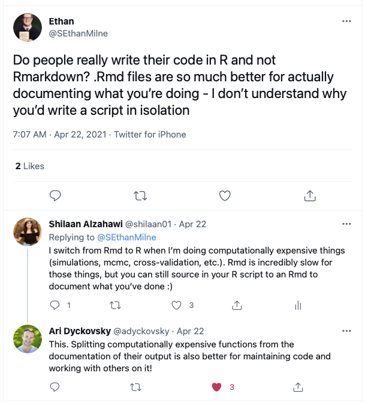
```
]

--

.pull-right[
```{r, echo = FALSE, out.width='100%'}
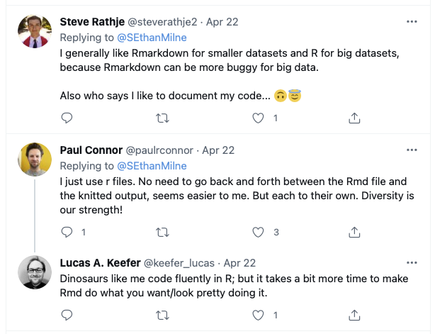
```
]


---


class: inverse, center, middle

# Part 1: RMarkdown

---

# Getting started with RMarkdown

- Install [`R`](https://cran.r-project.org/mirrors.html)
- Install [`RStudio`](https://www.rstudio.com/products/rstudio/download/)
- Install the `RMarkdown` package  
- Install $\LaTeX$ (e.g., `TinyTex`)

```{r eval=FALSE, tidy=FALSE}
install.packages("rmarkdown")
install.packages('tinytex') # for generating PDF output
tinytex::install_tinytex()  # install TinyTeX
```

```{r, out.width = '70%', echo = FALSE, fig.align='center'}
knitr::include_graphics("https://shilaan.rbind.io/post/building-your-website-using-r-blogdown/excited.jpg")
```

---

## Opening a new R Markdown

- Create a new R Markdown document from the menu  
`File -> New File -> R Markdown`

```{r, out.width = '50%', echo = FALSE, fig.align='center'}
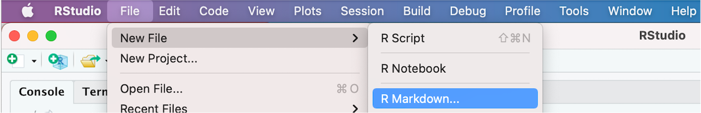
```

--

```{r, out.width = '50%', echo = FALSE, fig.align='center'}
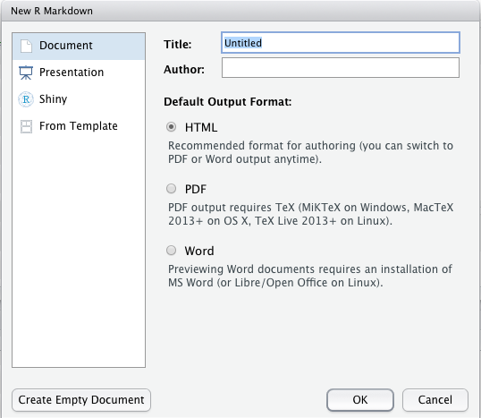
```

---

## Notebook interface

- Allows for direct interaction with R (execute code and display results inline)
- Makes it easy to test and iterate
- Produces a reproducible document with publication-quality output

```{r, out.width = '90%', echo = FALSE, fig.align='center'}
knitr::include_graphics("https://d33wubrfki0l68.cloudfront.net/07a00dd9669405f3cba06ef333db180295466252/7b153/lesson-images/how-2-chunk.png") 
```

---

## Three types of content
- YAML meta-data / frontmatter (between `---` and `---`)
- Text with Markdown formatting
- R code  

```{r, out.width = '95%', echo = FALSE, fig.align='center'}
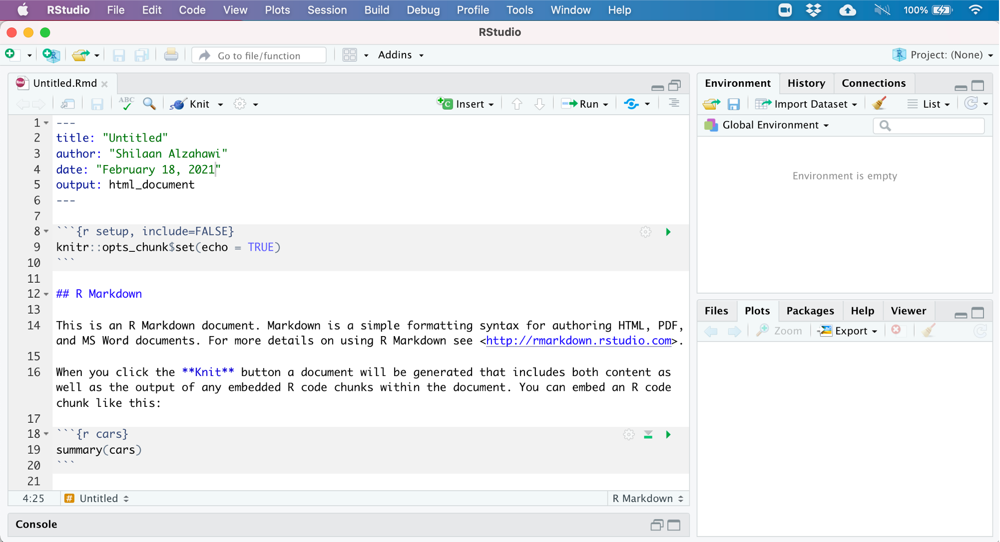 
```

---

class: inverse, center, middle

# Metadata

---
background-image: url("https://cwextensions.com/images/logo-someta.png")
background-position: 92% 7%
background-size: 10%

# YAML metadata 

The YAML header contains basic metadata and rendering instructions

```yaml
---
title: My R Markdown Report
author: Shilaan Alzahawi
output: pdf_document
date: "`r Sys.Date()`"
---
```

--

The date will be **dynamically updated** every time we knit the report,  
with the help of the following line of code (more on **in-line code** later): 

--

```{r, echo = FALSE, fig.align='left'}
knitr::include_graphics("images/date.png")
```


---


# Rendering a document

✓ 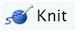  
✓ Windows/Linux: `Control + Shift + K`   
✓ OS X: `Command + Shift + K`
--
```{r, out.width = '70%', echo = FALSE, fig.align='center'}
knitr::include_graphics("https://github.com/allisonhorst/stats-illustrations/raw/master/rstats-artwork/rmarkdown_wizards.png")
```
Artwork by [@allison_horst](https://github.com/allisonhorst/stats-illustrations):  
**Become an RMarkdown knitting wizard**
---

## Output formats


---

## Output formats


---

## What's happening behind the scenes?


☞ The code within the `.Rmd` file is executed and converted into an `.md` file;  
☞ The `.md` file is converted to the output format specified in the metadata

---

## What's happening behind the scenes?

Knitting an `RMarkdown` file...

--

1. Starts a new R session  
✓ No packages or objects loaded

--

2. Sets your working directory to the location of the `RMarkdown` file

--

3. Executes all code chunks from top to bottom

--

### ⚠️ **Make sure to load all R packages you use!**

```{r, echo=FALSE, out.width='45%', fig.align='center'}
knitr::include_graphics("https://github.com/allisonhorst/stats-illustrations/raw/master/make-your-own-stats-cartoons/ex_4.png")
```
Artwork by [@allison_horst](https://github.com/allisonhorst/stats-illustrations)

---


class: inverse, center, middle

# Code

---

## Two types of code in RMarkdown

1. A code chunk, surrounded by three backticks and `{r}`
2. An inline code expression, surrounded by one backtick and `r`

```{r, echo=FALSE, out.width='95%', fig.align='left'}
knitr::include_graphics("https://d33wubrfki0l68.cloudfront.net/4c3760f9341ec07761c95fb5f03e033fa73d206d/057ff/lesson-images/inline-1-heat.png")
```

---

## Code chunks

--

"*Code chunks are the beating heart of our R Markdown.*" 
[Xie, Dervieux, Riederer 2021](https://bookdown.org/yihui/rmarkdown-cookbook/rmarkdown-anatomy.html) 

--

```{r}
summary(Orange)
```

--

### Inserting a code chunk

--
✓ Windows/Linux: `Control + Alt + I`  

--
✓ OS X: `Command + Option + I`  

--
✓ Enclosing code with three backticks and `{r}`  

--
✓ 
---


## Chunk options 

Control a chunk's behavior by passing additional, comma-separated arguments  

--

✓ `echo = TRUE` show code and output (*default*)

--

✓ `echo = FALSE` show output only (hide code)  

--

✓ `include = FALSE` do not show output (run code)  

--

✓ `eval = FALSE` show code (do not run; no output) 

--

✓ `warning = FALSE` removes warning messages  

--

✓ `error = FALSE` removes error messages  

--

✓ `message = FALSE` removes all messages 

--

```{r eval = FALSE}
summary(Orange)
```

--
**Bonus question:** What chunk option did I set here?


---

## More on code chunks

#### **Name your chunks**

Naming your chunks allows you to quickly navigate code, automatically name figures, and troubleshoot errors.

⚠️ Avoid spaces, underscores (`_`), and periods (.) in your chunk name

--

#### **Chunk execution**

Execute a  chunk with `Ctrl + Enter` or `Command + Enter` or press 


---

## In-line code

To insert in-line code, wrap your code in a single backtick. RMarkdown will always
- display the results of inline code, but not the code  
- apply relevant text formatting to the results  


--

**R Markdown document**   
```{r, echo = FALSE}
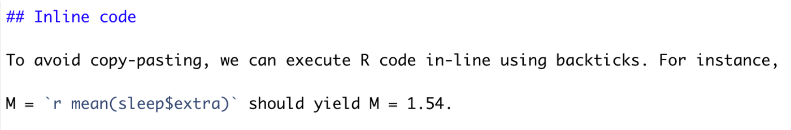
```

--
**Knitted HTML document**  
```{r, echo = FALSE}
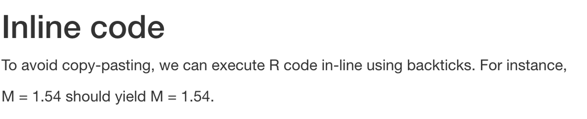
```


---

class: inverse, center, middle

# Text

---

# Markdown formatting basics


---

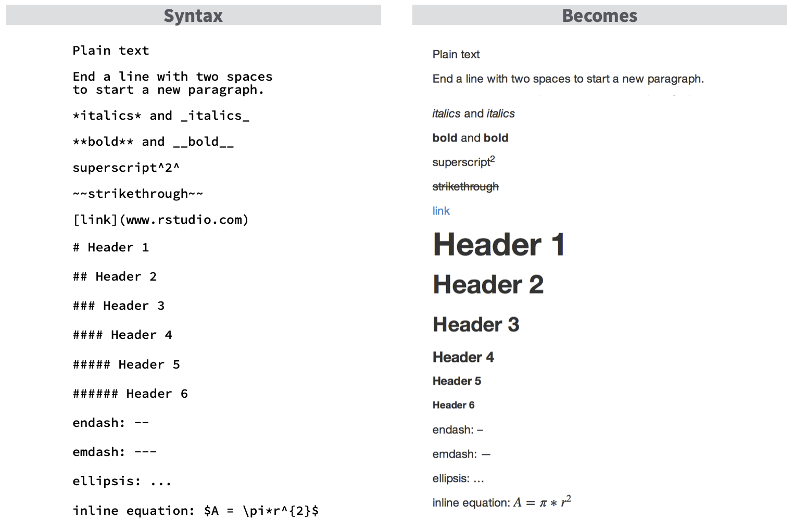

For more formatting options, see the [R Markdown Reference guide](https://www.rstudio.com/wp-content/uploads/2015/03/rmarkdown-reference.pdf?_ga=2.157796986.1542626288.1625161001-1806201684.1624641897)

---

## Tables 

```{r, echo = FALSE, out.width='90%'}
knitr::include_graphics("https://d33wubrfki0l68.cloudfront.net/09467251a219c3c6b2dae2bf1367e5736a9ef78c/feeea/lesson-images/tables-1-kable.png")
```

More on **APA tables** in Pt. 2!
---


## R Markdown tips and tricks

--

📦 Load all R packages in the first code chunk  

--

⚠️ Do not include `install.packages()` or `setwd()`  

--

 RMarkdown checks your spelling!  

--

⛑  `File > Help > Cheatsheets > R Markdown Cheat Sheet`   

--

💨 `File > Help > Markdown Quick Reference`  

--

### Resources 

- [R Markdown: The Definitive Guide](https://bookdown.org/yihui/rmarkdown/)
- [R Markdown Cookbook](https://bookdown.org/yihui/rmarkdown-cookbook/)

---

class: inverse, center, middle

# Part 2: papaja

---
class: center
background-image: url("images/papaja.png")
background-position: 50% 60%
background-size: 25%

# Getting started with papaja

**papaja** = **P**reparing **APA** **j**ournal **a**rticles  
created by [Frederik Aust](https://github.com/crsh/papaja)

---

background-image: url("images/manuscript.png")
background-position: 50% 80%
background-size: contain

## Sneak peek: APA title page

---

## Sneak peek: APA tables

--

```{r, echo = FALSE}
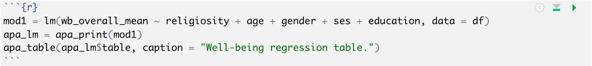
```

--

```{r, echo = FALSE, out.width='50%', fig.align='center'}
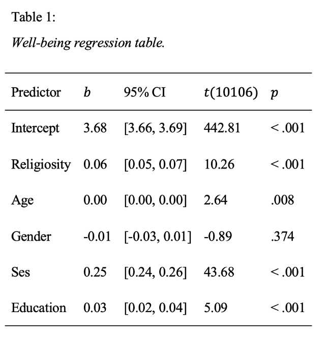
```

---
# Getting started with papaja

--

```{r, eval = FALSE}
# make sure you've already installed tinytex!
install.packages("devtools")
devtools::install_github("crsh/papaja@devel") #install papaja
```

--

`File > New File > R Markdown > From Template > APA article`

--

```{r, echo = FALSE, out.width='50%', fig.align='center'}
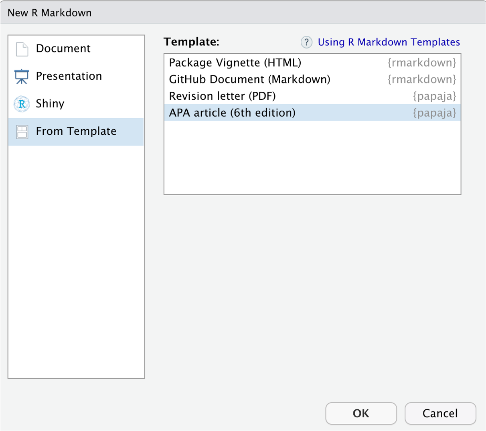
```


---
class: center
background-image: url("images/cites.png")
background-position: 50% 70%
background-size: contain

# APA citations
---

## Getting started with APA citations

--

1. Download [Zotero](https://www.zotero.org)

--

2. Download the [Better BibTex for Zotero extension](https://retorque.re/zotero-better-bibtex/)

--

3. Install citr: an RStudio Addin to Insert Markdown Citations  
▸ citr can directly access your reference database  
▸ citr can keep your reference file updated

--

```{r, eval = FALSE}
devtools::install_github("crsh/citr")
```

---
# Inserting citations

--

1. Create a reference file using a reference manager (e.g., Zotero)

--

2. Supply the reference file in the `---`front matter`---`  
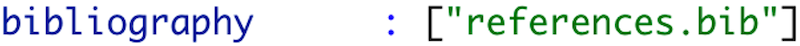
--

3. Insert citations  
--

▸ Insert using your citation key  
  
--

▸ Insert using `Addins > Insert citations`
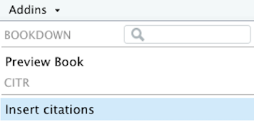


---
class: center
background-image: url("images/insert-citation.png")
background-position: 50% 50%
background-size: 85%

---
# Inserting citations

```{r, echo = FALSE}
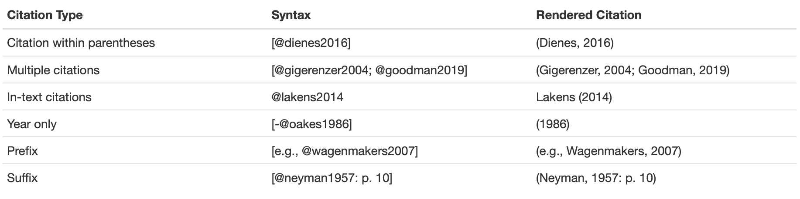
```

---
background-image: url("images/refs.png")
background-position: 50% 60%
background-size: contain

# Inserting citations

- You can cite R packages, too!
- After loading all packages, run `r_refs()` to create a BibTex file with references to all currently loaded packages

---

### Harnessing the power of meta-data, code, and text

--

**R Markdown document**   
```{r, echo = FALSE}
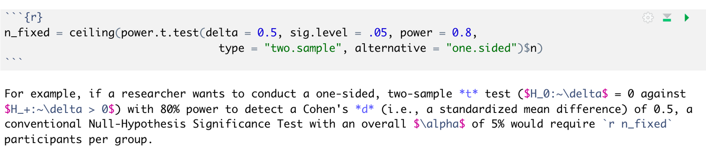
```

--
**Knitted APA manuscript**  
```{r, echo = FALSE}
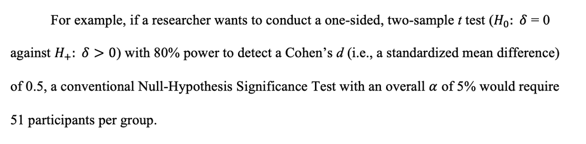
```

---

background-image: url("https://github.com/allisonhorst/stats-illustrations/raw/master/make-your-own-stats-cartoons/ex_1.png")
background-position: 50% 90%
background-size: 50%


## Statistical output

--

```{r, echo = FALSE}
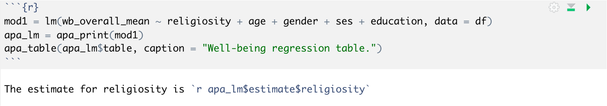
```

--

```{r, echo = FALSE, out.width='50%'}
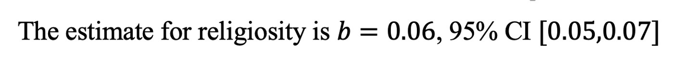
```

---
## Another look at APA tables

--

```{r, echo = FALSE}

```

--

```{r, echo = FALSE, out.width='50%', fig.align='center'}

```


---
background-image: url("images/papaja.png")
background-position: 90% 80%
background-size: 25%

# pajaja tips and tricks

--

Define a keyboard shortcut for inserting citations  
✂︎ `Tools > Addins > Browse Addins > citr > Keyboard Shortcuts`

--

### Helpful resources

- The [papaja manual](http://frederikaust.com/papaja_man/)  
- [Papers](https://github.com/crsh/papaja#papers-written-with-papaja) written with papaja
---


class: right

```{r, out.width = '65%', echo = FALSE, fig.align='center'}
knitr::include_graphics("https://github.com/allisonhorst/stats-illustrations/blob/master/rstats-artwork/r_first_then.png?raw=true")
```

Artwork by [@allison_horst](https://github.com/allisonhorst/stats-illustrations)


---

class: center, middle

# Thank you!

❤︎ Slides created with the R package [**xaringan**](https://github.com/yihui/xaringan).


**Questions?** Reach out to me at **shilaan@stanford.edu**
